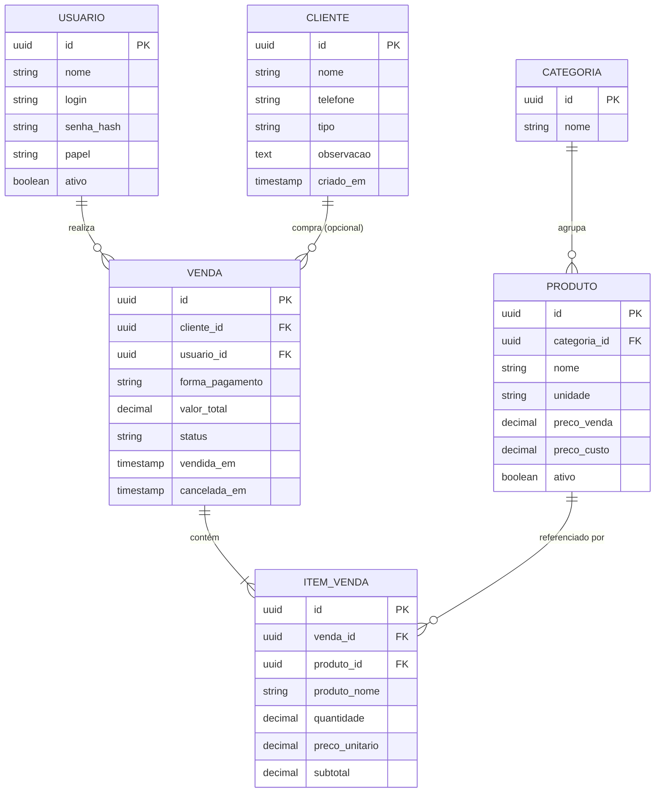

# Modelo de Dados — Prumo

**Versão:** 0.1 (rascunho em construção)
**Data:** 24/07/2026
**Escopo:** MVP (Fases 1 e 2 do roadmap) com ganchos preparados para as fases futuras
**Status:** Em elaboração — evolui junto com o [documento de requisitos](Prumo-Requisitos-v0.1.md)

---

## 1. Princípios do modelo

Cada decisão abaixo tem origem direta nos requisitos. Elas explicam *por que* o modelo é assim e não de outro jeito.

| # | Princípio | Origem | Como o modelo atende |
|---|---|---|---|
| P1 | **Sempre registrar quem vendeu** | RF13, seção 3 | Existe `usuarios` desde o MVP; `venda.usuario_id` é obrigatório, mesmo com um operador só. |
| P2 | **Não travar o balcão** | RF02, RF03 | `cliente` só exige nome e telefone; `venda.cliente_id` é **anulável** (venda "Consumidor"). |
| P3 | **Preço negociado é congelado na venda** | RF12 | `item_venda` guarda `preco_unitario` **próprio**, copiado no momento da venda — nunca lido do produto depois. |
| P4 | **Histórico é imutável por natureza** | RF04, painel | Venda não é sobrescrita ao editar preço de produto. Relatórios usam o valor gravado no item. |
| P5 | **Preparar sem construir** | Fases 2–4 | Ganchos presentes (categoria, unidade, custo opcional), mas sem tabelas de estoque/previsão ainda. |
| P6 | **Nada é apagado de verdade** | RF14, auditoria | Cancelamento/exclusão é *soft delete* (`status` / `cancelada_em`), preservando o histórico. |

---

## 2. Visão geral (diagrama)

---

## 3. Dicionário de dados

### 3.1 `usuario` — quem opera o sistema
> Existe desde o MVP para viabilizar o indicador "quem vendeu quanto" (RF13, RF20) sem retrabalho futuro.

| Campo | Tipo | Obrigatório | Notas |
|---|---|:---:|---|
| `id` | UUID | ✔ | Chave primária. |
| `nome` | texto | ✔ | Nome exibido no ranking de vendedores. |
| `login` | texto | ✔ | Único. No MVP pode haver um único registro (o dono). |
| `senha_hash` | texto | ✔ | Nunca armazenar senha em texto puro. |
| `papel` | texto | ✔ | `dono`, `vendedor`, `caixa`, `estoque`. No MVP: só `dono`. Gancho para RNF05. |
| `ativo` | booleano | ✔ | Desativa sem apagar (preserva histórico de vendas). |
| `criado_em` | timestamp | ✔ | |

### 3.2 `cliente` — quem compra
> Cadastro mínimo para não atrapalhar o atendimento (RF02). Venda avulsa não exige cliente (RF03).

| Campo | Tipo | Obrigatório | Notas |
|---|---|:---:|---|
| `id` | UUID | ✔ | |
| `nome` | texto | ✔ | Mínimo obrigatório. |
| `telefone` | texto | ✔ | Mínimo obrigatório. Usado na busca (RF05). |
| `tipo` | texto | ✖ | `consumidor_final`, `pedreiro`, `construtora`, `revenda` (RF01). Anulável até ser informado. |
| `observacao` | texto | ✖ | Campo livre; não travar o balcão. |
| `criado_em` | timestamp | ✔ | Base para frequência de compra e alerta de sumido (RF23, RF24). |

### 3.3 `categoria` — agrupamento de produtos
> Suporta o filtro "produtos mais vendidos por categoria" e a organização do catálogo (RF09).

| Campo | Tipo | Obrigatório | Notas |
|---|---|:---:|---|
| `id` | UUID | ✔ | |
| `nome` | texto | ✔ | Ex.: cimento, cerâmica, hidráulica, elétrica, agregados, ferro. |

### 3.4 `produto` — o que se vende
| Campo | Tipo | Obrigatório | Notas |
|---|---|:---:|---|
| `id` | UUID | ✔ | |
| `categoria_id` | UUID (FK) | ✖ | Anulável para não travar cadastro rápido. |
| `nome` | texto | ✔ | |
| `unidade` | texto | ✔ | `saco`, `milheiro`, `m3`, `peca`, `barra`, `kg`, `metro`, `carrada` (RF07). |
| `preco_venda` | decimal | ✔ | Preço **sugerido**; o preço real fica no item da venda (P3). |
| `preco_custo` | decimal | ✖ | Para margem (RF08 — *a confirmar se entra no MVP*). |
| `ativo` | booleano | ✔ | Soft delete. |

> ⚠️ **Decisão-chave:** `produto.preco_venda` é só uma *sugestão de partida*. O valor que conta para o faturamento é sempre `item_venda.preco_unitario`.

### 3.5 `venda` — o núcleo do sistema
> A tabela mais crítica. Toda a meta dos "30 segundos" (RF11) e todo o painel (RF16–RF22) dependem dela.

| Campo | Tipo | Obrigatório | Notas |
|---|---|:---:|---|
| `id` | UUID | ✔ | |
| `cliente_id` | UUID (FK) | ✖ | **Anulável** = venda "Consumidor" (RF03). |
| `usuario_id` | UUID (FK) | ✔ | Quem efetuou (RF13). Nunca nulo. |
| `forma_pagamento` | texto | ✔ | `dinheiro`, `pix`, `cartao`, `fiado` (*fiado a confirmar — RF15*). |
| `valor_total` | decimal | ✔ | Soma dos itens; gravado (não recalculado on-the-fly) para performance do painel. |
| `status` | texto | ✔ | `concluida`, `cancelada` (RF14). |
| `vendida_em` | timestamp | ✔ | Data/hora da venda; base de todos os filtros de período (RF21). |
| `cancelada_em` | timestamp | ✖ | Preenchido no cancelamento (soft delete — P6). |

### 3.6 `item_venda` — os itens de cada venda
> Relação N:N entre venda e produto, com os dados **congelados** no momento da venda.

| Campo | Tipo | Obrigatório | Notas |
|---|---|:---:|---|
| `id` | UUID | ✔ | |
| `venda_id` | UUID (FK) | ✔ | |
| `produto_id` | UUID (FK) | ✔ | Referência para relatórios de produto (RF19). |
| `produto_nome` | texto | ✔ | **Cópia** do nome na hora da venda — o histórico não muda se o produto for renomeado/apagado. |
| `quantidade` | decimal | ✔ | Decimal (aceita 1,5 m³, 0,5 kg). |
| `preco_unitario` | decimal | ✔ | **Congelado** no momento da venda (RF12, P3). |
| `subtotal` | decimal | ✔ | `quantidade × preco_unitario`, gravado. |

---

## 4. Regras de negócio que o modelo garante

1. **Faturamento é sempre histórico-fiel.** Somar `item_venda.subtotal` — nunca recalcular pelo preço atual do produto.
2. **Toda venda tem um vendedor.** `usuario_id NOT NULL` torna impossível uma venda órfã.
3. **Cancelar não apaga.** `status = cancelada` + `cancelada_em`; relatórios filtram `status = concluida`.
4. **"Consumidor" é a ausência de cliente**, não um cliente fake. `cliente_id IS NULL`.
5. **Ticket médio, curva ABC e ranking** (RF17, RF18, RF25) saem todos de `venda` + `item_venda`, sem tabela extra.
6. **Alerta de cliente sumido** (RF24) é uma *query* sobre `MAX(vendida_em)` por cliente — não precisa de tabela nova.

---

## 5. Fora do escopo deste modelo (por ora)

Deixado de fora **de propósito** para manter o MVP enxuto — cada item entra na sua fase:

| Item | Entra em | Por quê não agora |
|---|---|---|
| `estoque` / `movimento_estoque` | Fase 2 | Só após inventário físico (risco declarado). |
| `entrada_mercadoria` / `nota` | Fase 2 | Depende de disciplina de entrada de nota. |
| `previsao` / séries temporais | Fase 3 | Exige 12–24 meses de histórico. |
| Fiado / caderneta (`conta_cliente`) | *A confirmar* | Ponto em aberto nº 1 dos requisitos. |
| Orçamento antes da venda | *A confirmar* | Ponto em aberto nº 4. |

---

## 6. Pontos em aberto (impactam o modelo)

1. **Fiado entra no MVP?** Se sim, precisamos de `forma_pagamento = fiado` **+** uma noção de saldo/quitação por cliente. Hoje deixei só o enum preparado.
2. **`preco_custo` é escopo do MVP?** Define se calculamos margem já na fase 1 (RF08).
3. **Categoria será obrigatória?** Hoje é anulável para não travar o cadastro; pode virar obrigatória se o painel por categoria for prioridade.

---

## Histórico de Versões

| Versão | Data | Alterações |
|---|---|---|
| 0.1 | 24/07/2026 | Modelo inicial derivado do documento de requisitos v0.1 |
